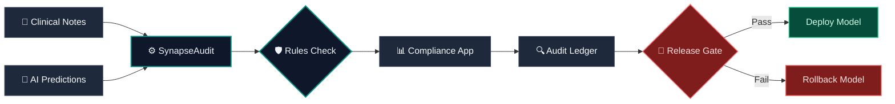

# SynapseAudit

[](https://github.com/Navneet-Scaler/SynapsAudit)
[](https://navneet-scaler-synapsaudit-dashboardsapp-k5q7lf.streamlit.app/)

### The Problem
Changes in base clinical NLP models or LLM prompt variations introduce silent code and prompt drift, leading to under-billing (missed HCC codes) or severe compliance risks (omitted billing modifiers and overcoded E/M levels).

### The Solution
**SynapseAudit** is an offline clinical NLP regression and compliance engine designed for deterministic validation of model-predicted ICD-10 and CPT codes, modifier logic, and HCC capture against a human-adjudicated gold-standard dataset.

### The Target Audience
This engine is built for **Product Analysts**, **AI QA Engineers**, and **Clinical Compliance Officers** to audit model revisions and enforce safety gates before deploying NLP pipelines.

---

## Visual Workflow & Pipeline Architecture



> [!NOTE]
> ### 💡 Understanding the Business: The "Doctor, AI, and Insurance" Story
> 
> **1. What is actually happening here?**
> *   **The Doctor's Work**: When you visit a doctor, they write a detailed clinical note summarizing your symptoms, diagnoses, and treatments.
> *   **The AI's Job**: Hospitals use Clinical NLP AI models to read these medical notes and translate them into standardized billing codes (like ICD-10 for diseases and CPT for procedures).
> *   **The Insurance Claim**: The hospital sends these codes to the insurance company to request payment.
> 
> **2. Why is this validation engine (SynapseAudit) needed?**
> *   **If the AI under-codes (Misses details)**: For example, if the AI misses that a patient has chronic diabetes (an HCC code), the hospital gets paid less than they should.
> *   **If the AI over-codes (Exaggerates details) or forgets billing rules**: For example, if the AI lists a procedure but forgets to attach a mandatory billing modifier (Modifier 25), the insurance company immediately rejects the claim. This delays hospital payments and triggers federal audits (compliance liabilities).
> *   **The Problem of "AI Drift"**: Software updates or prompt tweaks to the AI model can cause it to suddenly lose accuracy on specific specialties (e.g., Cardiology), leading to systemic billing failures.
> 
> **3. Who pays us for this service?**
> *   **Hospital Networks & Healthcare Systems**: They pay for this tool to prevent millions of dollars in insurance claim rejections and audits.
> *   **Autonomous AI Coding Vendors (like Arintra)**: They pay for this engine as a quality assurance tool to verify and stress-test new prompt updates or AI versions before releasing them to their hospital clients.
> 
> *SynapseAudit acts as the regression testing gate—making sure that upgrading the AI doesn't cause it to become worse at coding and bankrupt the hospital.*

---

## Key Metrics

| Metric | Definition |
| :--- | :--- |
| **Exact-Match Accuracy** | The percentage of clinical encounters where the model's predicted codes perfectly match the gold-standard codes. |
| **Modifier Accuracy** | The percentage of eligible encounters where Modifier 25 is correctly attached to E/M codes when a separate procedure is performed. |
| **Unit Accuracy** | The percentage of medication dosage matches where the predicted code matches the correct unit (e.g., `mcg` vs. `mg`). |
| **HCC Capture Rate** | The percentage of gold-standard Hierarchical Condition Categories (HCCs) correctly captured by the model. |
| **Regression Delta** | The net performance difference (F1, Kappa, or accuracy) between the baseline model and the candidate model. |
| **Cohen’s Kappa ($\kappa$)** | Statistical measure of agreement between the model's predictions and human coders, adjusted for chance agreement. |
| **Claim Deniability Risk Index (CDRI)** | A composite compliance score indicating the density of NCCI conflicts, wrong modifiers, and overcoded E/M levels. |

---

## Data Provenance & Safety
To ensure compliance and realistic benchmarking, the engine runs on a validation dataset composed of:
1. **Deidentified Clinical Notes**: Semi-structured clinical profiles inspired by the MIMIC-IV-Note database (discharge summaries and radiology reports).
2. **Specialty Transcripts**: Outpatient encounter notes representing clinical text patterns from MTSamples (e.g., Cardiology, Orthopedics).
3. **Synthetic Edge Cases**: Simulated safety-critical scenarios containing billing challenges such as Modifier 25 eligibility, NCCI mutually exclusive procedures, and levothyroxine dosage unit checks.
4. **Gold-Standard Labeled Truth**: A simulated consensus coder dataset acting as the ground-truth baseline.

---

## Operational Release Gate Logic
The automated release gate (`src/release_gate.py`) evaluates candidates before staging deployment. A candidate version will fail deployment if:
- **Modifier Accuracy Drops**: Any decrease in Modifier 25 accuracy compared to the baseline (`v1`).
- **HCC Misses Increase**: Any rise in missed Hierarchical Condition Categories.
- **Unit Confusion Rises**: Any instance of dosage unit confusion (`mg` vs. `mcg`).
- **Specialty Drift Exceeds Tolerance**: Specialty-level F1-score drop greater than $2\%$.

---

## Version Comparison
SynapseAudit tracks side-by-side performance of model configurations:
- **Baseline Version (v1)**: Matches the standard production configuration (e.g., stable system prompt).
- **Candidate Version (v2)**: Represents the updated candidate (e.g., modified system prompt or updated base model).
- **Drift by Specialty**: Captures where specific medical specialties (e.g., Cardiology, Orthopedics) degrade under prompt modifications.

---

## Explainable Audit Ledger
The audit workflow is designed to allow clinical review teams to trace decisions:
- **Clinical Note Segment**: The raw clinical text.
- **Evidence-Span Highlighting**: Visual highlights indicating exactly where the model matched a code.
- **Predicted vs. Gold Codes**: Comparison of extracted codes side-by-side.
- **Mismatch Reason**: Detailed error categories (e.g., `hcc_miss`, `wrong_modifier`, `unit_confusion`).
- **Reviewer Decision**: Interactive buttons to record Auditor agreement (`Agree` / `Disagree`).

---

## Project Impact
- **200+** Simulated and deidentified clinical notes audited.
- **7** Core compliance and accuracy metrics evaluated per model version.
- **4** Major automated billing rule engines (Modifier 25, NCCI, Unit Mismatch, HCC Gap).
- **1** Unified CLI release gate to prevent regression deployments.

---

## Quick Start Setup

### 1. Installation & Environment Setup
Clone the repository and install requirements:
```bash
git clone https://github.com/Navneet-Scaler/SynapsAudit.git
cd SynapsAudit
pip install -r requirements.txt
```

### 2. Database Initialization
Build the SQLite analytics database containing baseline and candidate records:
```bash
python3 data/mock_generator.py
```

### 3. Run Automated Tests
Verify compliance rules, metrics, and gate checks:
```bash
python3 -m pytest
```

### 4. Run Release Gate Check
Run the CLI gate to verify if candidate `v2` matches compliance rules:
```bash
python3 src/release_gate.py
```

### 5. Launch the Dashboard
Run the Streamlit dashboard:
```bash
python3 -m streamlit run dashboards/app.py
```
