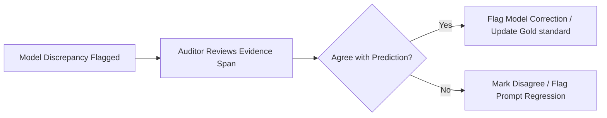

# Explainable Audit Ledger Workflow

The Explainable Audit Ledger is the primary interface for clinical reviewers to inspect, verify, and resolve NLP coding discrepancies.

## Reviewer Traceability Schema

For every audited encounter, the ledger displays the following critical fields:

1. **Note Text**: The raw clinical note segment (discharge summary or specialty consult transcript).
2. **Highlighted Span**: The precise word/character index span from the note that triggered the model's extraction (providing evidence-based justification).
3. **Predicted Code**: The ICD-10 or CPT code extracted by the candidate model.
4. **Gold Code**: The human-adjudicated ground-truth code assigned by coding experts.
5. **Mismatch Reason**: The classified error type (e.g., `wrong_modifier`, `hcc_miss`, `unit_confusion`, `ncci_conflict`).
6. **Reviewer Decision**: Interactive buttons where the auditor records whether they `Agree` or `Disagree` with the model's prediction.

## Review Action Lifecycle

This traceability ensures that all model changes are verified with clear clinical context rather than generic black-box accuracy numbers.
